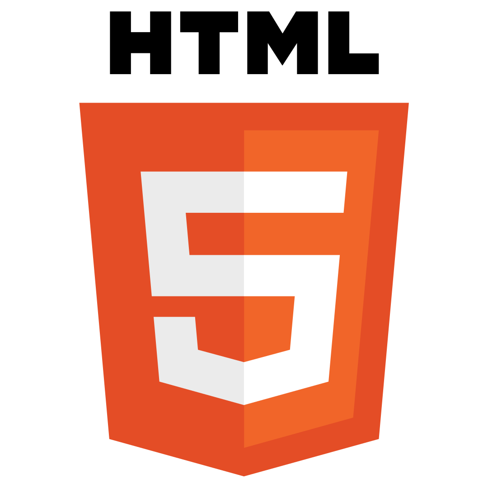
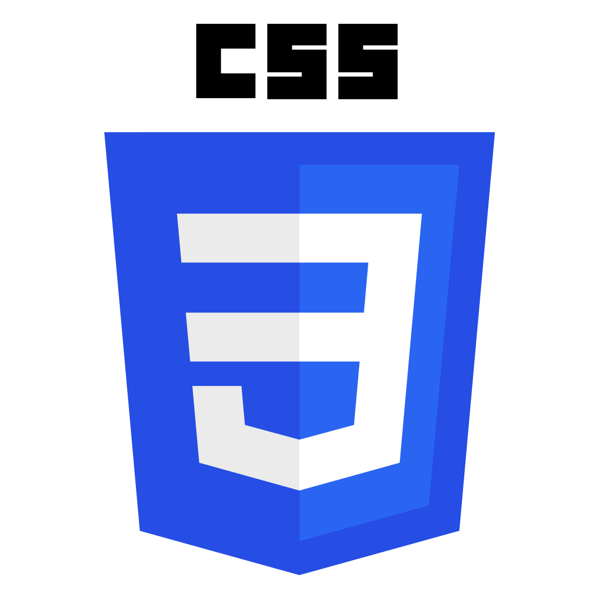
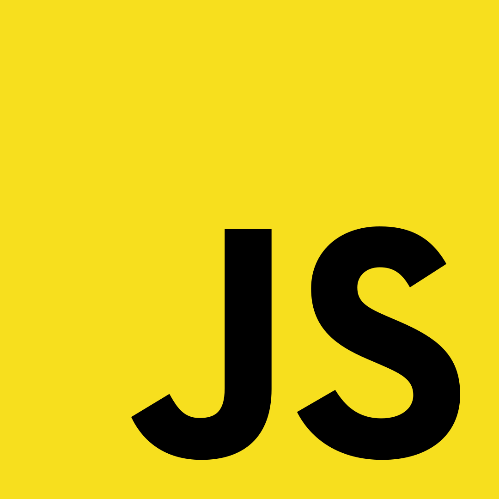
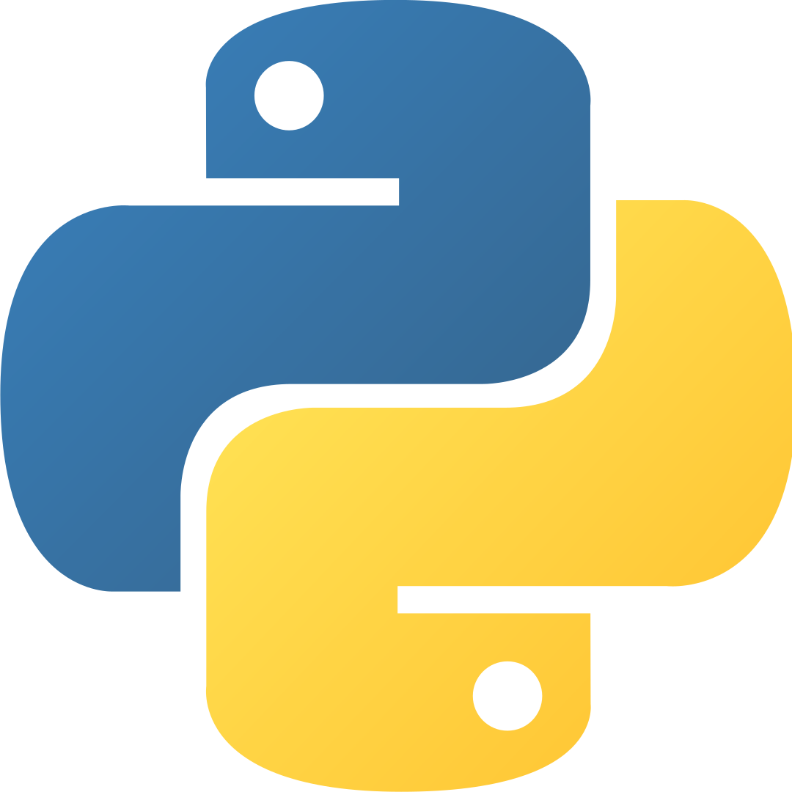
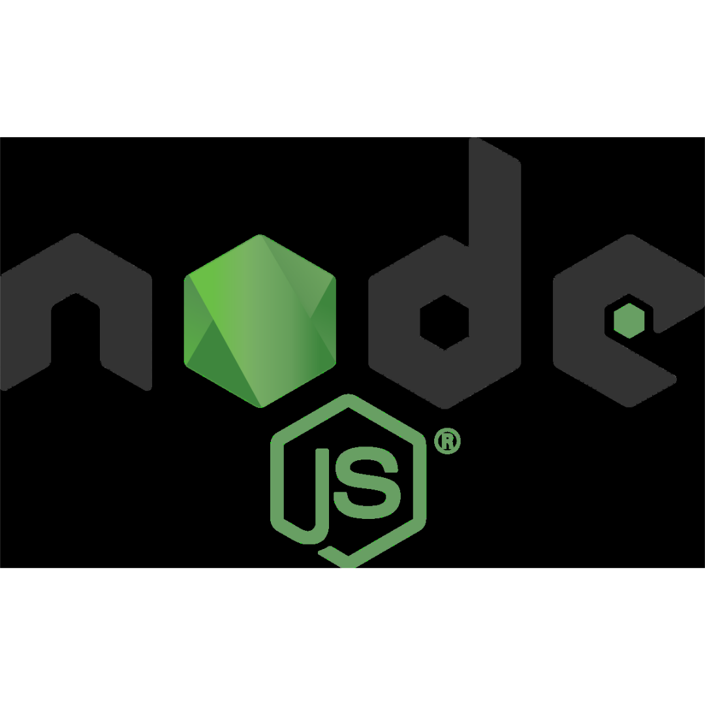

 

**Hi, I'm Estefania. I'm a software developer and computer science instructor. I love teaching, learning, and helping others realize how amazing and powerful programming can be.**

I create online courses in English and Spanish to teach programming and computer science.

I'm part of the freeCodeCamp Staff, where I run the [**freeCodeCamp Español**](https://www.youtube.com/freecodecampespanol) YouTube Channel, create courses, and write articles.

-----

### 🎓 Online Courses

I created and teach these online courses:

#### English

- [Python OOP - Object Oriented Programming for Beginners](https://www.udemy.com/course/python-object-oriented-programming-oop/)
- [Visual Studio Code for Developers 2022: Beginner to Advanced](https://www.udemy.com/course/learn-visual-studio-code-vscode-course/)
- [Python Exercises for Beginners: Solve 100+ Coding Challenges](https://www.udemy.com/course/python-exercises-for-beginners-solve-coding-challenges/)

▶ You can find my 12+ online courses on [**Udemy**](https://www.udemy.com/user/estefania-cn/). 

#### Spanish

- [Aprende HTML y CSS - Curso Desde Cero](https://www.youtube.com/watch?v=XqFR2lqBYPs)
- [Aprende JavaScript - Curso Completo desde Cero](https://www.youtube.com/watch?v=ivdTnPl1ND0)
- [Introducción a Programación en Python](https://www.youtube.com/watch?v=DLikpfc64cA)
- [Aprende React Desde Cero - Curso de React Con Proyectos](https://www.youtube.com/watch?v=6Jfk8ic3KVk)
- [Aprende Node.js y Express - Curso desde Cero](https://www.youtube.com/watch?v=1hpc70_OoAg)

**Note:** these courses are published on [**freeCodeCamp Español**](https://www.youtube.com/freecodecampespanol). 

--------

### 📘 My articles 

#### English

- [Python Code Examples – Sample Script Coding Tutorial for Beginners](https://www.freecodecamp.org/news/python-code-examples-sample-script-coding-tutorial-for-beginners/)

- [What is Python Used For? 10+ Coding Uses for the Python Programming Language.](https://www.freecodecamp.org/news/what-is-python-used-for-10-coding-uses-for-the-python-programming-language/)

- [Dijkstra's Shortest Path Algorithm - A Detailed and Visual Introduction](https://www.freecodecamp.org/news/dijkstras-shortest-path-algorithm-visual-introduction/)

▶ [**More articles...**](https://freecodecamp.org/news/author/estefaniacn)

#### Spanish

- [¿Para qué se usa Python? 10+ usos del lenguaje de programación Python](https://www.freecodecamp.org/espanol/news/para-que-se-usa-python-10-usos-del-lenguaje-de-programacion-python/)

- [Python ejemplos de código – tutorial de programación en Python desde cero para principiantes](https://www.freecodecamp.org/espanol/news/python-ejemplos-de-codigo-tutorial-de-programacion-en-python-desde-cero-para-principiantes/)

- [Python cómo escribir en un archivo - abrir, leer, escribir y otras funciones de archivos explicadas](https://www.freecodecamp.org/espanol/news/python-como-escribir-en-un-archivo-abrir-leer-escribir-y-otras-funciones-de-archivos-explicadas/)

▶ [**Más artículos...**](https://www.freecodecamp.org/espanol/news/author/estefaniacn)

--------

### 🌐 Social Media

You can find me on:

- Twitter: [**@EstefaniaCassN**](https://twitter.com/EstefaniaCassN)
- Udemy: [**My Instructor Profile**](https://www.udemy.com/user/estefania-cn/)
- YouTube: [**Coding with Estefania**](https://www.youtube.com/codingwithestefania) 
 
--------
